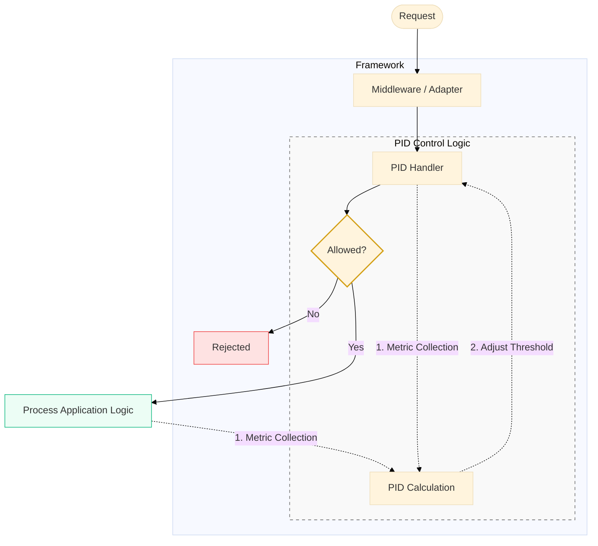

# Rate Limiter PID Controller

This project is an **opinionated implementation of a rate limiter**, inspired by Uber’s [Cinnamon blog post](https://www.uber.com/en-ES/blog/cinnamon-using-century-old-tech-to-build-a-mean-load-shedder/?uclick_id=023fa4c1-0abf-4379-ad4d-62ed0a214924).  
It is designed to be framework-agnostic and written in plain TypeScript with zero heavy dependencies, with the goal of being easily integrated as a dependency in plain NodeJs or using a framework such as **Express** or **NestJS**.

## Usage

Choose how you want to integrate the PID rate limiter:

- **Standalone Core**  
  Use the PID controller directly in any Node.js project.  
  🔗 [Core README](https://github.com/jfrz38/rate-limit-pid-controller/tree/main/code/core/README.md) 

- **Framework Adapters**  
  Plug the controller into your framework with minimal setup:  
  🔗 [Express Adapter](https://github.com/jfrz38/rate-limit-pid-controller/tree/main/code/adapters/express/README.md) 
  🔗 [NestJS Adapter](https://github.com/jfrz38/rate-limit-pid-controller/tree/main/code/adapters/nestjs/README.md) 

> You can either control requests manually via the core or handle them automatically with middleware.

Also you can check [simulation examples](./simulation/README.md).

## Motivation

Uber’s Cinnamon introduced a novel approach to rate limiting by combining **PID controllers** with traffic-shaping techniques.  
Unlike classic token bucket or leaky bucket implementations, this design allows for:

- Adjust limits **dynamically** based on system feedback.
- Handle bursts and varying loads **smoothly**.
- Maintain **predictable latencies** while avoiding over-provisioning.

This project implements a **simplified, opinionated version** of Cinnamon’s approach for easy integration and experimentation.

_(simplified logic):_

> [!NOTE]  
> Check extended explanation into [Core project](./code/core/README.md#All%20pieces%20together).

## Features

- PID-based dynamic rate limiting.
- Pluggable adapters for different frameworks (e.g., NestJS, Express).
- Configurable thresholds, recovery, and overload handling.
- Designed for **high concurrency** environments.
- Priority-based shedding dropping background tasks during high-load periods while keeping critical requests alive.

## How it works

Standard rate limiters are static: you set 100 RPS, and it stays at 100 RPS. This project uses a **PID Controller**, which acts like a **smart thermostat** for your server:

1. **Error Calculation**: It constantly compares your current system health (latency/concurrency) against a "ideal" target.
2. **Dynamic Thresholding**: Instead of a fixed number, it calculates a **Priority Threshold**.
3. **Load Shedding**: Only requests with a priority higher than the current threshold are allowed.
4. **Self-Correction**: If the server slows down, the PID raises the threshold automatically. As it recovers, it gracefully lowers it back.

## References

- [Cinnamon: Using Century Old Tech to Build a Mean Load Shedder](https://www.uber.com/en-ES/blog/cinnamon-using-century-old-tech-to-build-a-mean-load-shedder/?uclick_id=023fa4c1-0abf-4379-ad4d-62ed0a214924).  
- [PID Controller for Cinnamon](https://www.uber.com/en-ES/blog/pid-controller-for-cinnamon/?uclick_id=023fa4c1-0abf-4379-ad4d-62ed0a214924).  
- [Cinnamon Auto-Tuner: Adaptive Concurrency in the Wild](https://www.uber.com/en-ES/blog/cinnamon-auto-tuner-adaptive-concurrency-in-the-wild/).  
