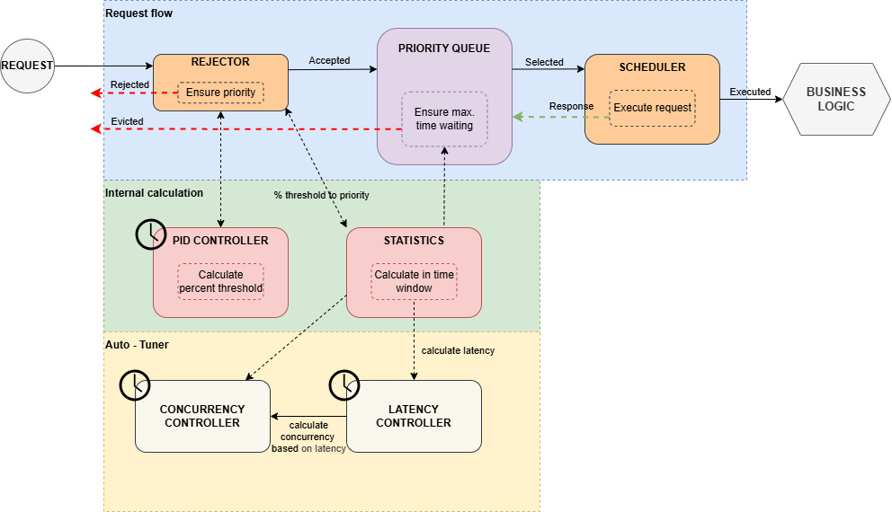

# PID Controller - Core

[](https://www.npmjs.com/package/@jfrz38/pid-controller-core)
[](https://github.com/jfrz38/rate-limit-pid-controller/actions/workflows/build-core.yml)
[](https://www.npmjs.com/package/@jfrz38/pid-controller-core)
[](https://github.com/jfrz38/rate-limit-pid-controller/blob/main/LICENSE)
[](https://www.npmjs.com/package/@jfrz38/pid-controller-core)


This is the engine of the project. It contains the mathematical logic, the statistics aggregator, and the priority-based thresholding system. It is **zero-heavy-dependency**, framework-agnostic, and written in plain TypeScript.

## Core Pillars

The core is built around three main concepts:

1. **PID Controller**: The "brain" that calculates the current allowed traffic threshold based on the error between real-time metrics and target goals (ideal system state).
2. **Statistics Engine**: A sliding-window aggregator that tracks latency, throughput, and completed requests rates.
3. **Thresholding Logic**: A non-binary admission system. Instead of a simple "on/off" switch, the controller calculates a floating threshold. Each incoming request is evaluated based on its assigned priority: during congestion, the system "sheds" low-priority background tasks first to guarantee resources for critical user-facing operations. **Note that lower priorities are for most important requests**.

More information in [References section](https://github.com/jfrz38/rate-limit-pid-controller/blob/main/README.md#references).

## Installation

```bash
npm install @jfrz38/pid-controller-core
```

## Quick Start

For usage in NestJS or Express check corresponding documentation.

- [Express Adapter](https://github.com/jfrz38/rate-limit-pid-controller/tree/main/code/adapters/express/README.md)  
- [NestJS Adapter](https://github.com/jfrz38/rate-limit-pid-controller/tree/main/code/adapters/nestjs/README.md)

In plain NodeJS you can create an object with required parameters:

```ts
import { PidController, Statistics, Scheduler } from '@jfrz38/pid-controller-core';

const controller = new PidControllerRateLimit({
    // Configuration
});

const priority = 0; // your priority
const task = () => { /* ... */ }
controller.run(task, priority);
```

## Configuration Reference

The parameters configuration allows you to fine-tune the controller. You can use the [`DefaultOptions`](https://github.com/jfrz38/rate-limit-pid-controller/blob/main/code/core/src/default-parameters.ts) helper to fill in missing values.

| Parameter                                    | Type   | Default        | Description                                                                                                                                        |
|----------------------------------------------|--------|----------------|----------------------------------------------------------------------------------------------------------------------------------------------------|
| `threshold.initial`                          | number | 768            | Starting threshold value. Based on 6 priority levels (0-5) with 128 cohorts each.                                                                  |
| `log.level`                                  | string | 'warn'         | Minimum severity level to output logs `trace`, `debug`, `info`, `warn` `error`, `fatal`.                                                           |
| `pid.KP`                                     | number | 0.2            | **Proportional Gain**: Controls the immediate response to the current error.                                                                       |
| `pid.KI`                                     | number | 0.5            | **Integral Gain**: Corrects long-term steady-state error by accumulating past errors.                                                              |
| `pid.KD`                                     | number | 0              | **Derivative Gain**: Predicts future error by reacting to the rate of change (dampening).                                                          |
| `pid.interval`                               | number | 500            | Time between PID recalculations in milliseconds.                                                                                                   |
| `pid.delta`                                  | number | 10             | Maximum allowed threshold change (%) per interval to prevent abrupt fluctuations.                                                                  |
| `pid.decayRatio`                             | number | 0.5            | Factor (0-1) to reduce the integral term over time, preventing integral windup.                                                                    |
| `timeout.priorityQueue.value`                | number | 500            | Base time in ms before a queued request is considered for eviction.                                                                                |
| `timeout.priorityQueue.ratio`                | number | 0.33           | Adjusts the eviction timeout based on average request duration.                                                                                    |
| `capacity.maxConcurrentRequests`             | number | 10             | Maximum number of requests allowed to be processed simultaneously.                                                                                 |
| `capacity.cores`                             | number | max. available | Number of CPU cores to utilize (defaults to the total available on the machine).                                                                   |
| `statistics.minRequestsForStats`             | number | 5              | Minimum samples required before the engine starts generating valid metrics.                                                                        |
| `statistics.minRequestsForLatencyPercentile` | number | 250            | Samples needed to ensure statistical significance for percentile calculations.                                                                     |
| `statistics.latencyPercentile`               | number | 90             | The target percentile (e.g., P90) used to find current threshold based on statistics.                                                              |
| `interval.maxRequests`                       | number | 1000           | Maximum sample size for the interval queue. Oldest requests are shedded when limit is reached                                                      |
| `interval.requestInterval.minIntervalTime`   | number | 2              | **Minimum window duration** (in seconds). Ensures statistics aren't based on too short a time slice, avoiding over-reaction to micro-bursts.       |
| `interval.requestInterval.maxIntervalTime`   | number | 30             | **Maximum window duration** (in seconds). Limits how far back the system looks, ensuring statistics remain relevant to current traffic conditions. |

## Architecture Flow

The PID follows a Closed-Loop Control System pattern:

1. **Admission**: The Scheduler checks if the Request Priority is allowed based on internal-calculated Threshold.
2. **Execution**: If admitted, the task runs and a high-resolution timer measures its latency.
3. **Feedback**: Upon completion, metrics are sent to the Statistics Engine.
4. **Correction**: Every interval (default 500ms), the PID Controller recalculates the Threshold based on how far the current iteration is from the target.

## Advanced Concepts

### The Threshold Variable

Unlike traditional limiters where you define a capacity, here the *Threshold* is a dynamic value.

- A threshold of maximum value means the system is healthy: everything is allowed.
- A threshold of 0.0 (minimum value) means no requests are allowed because server is overcharged.

By the way, *Threshold* is not PID value itself but PID percent used to find target priority allowed based on last requests statistics.

### All pieces together

The system consists of several interconnected components working in sync. The core logic follows this idea:



When the system initializes, all components marked with a **clock** start executing periodically and infinitely. These background tasks ensure the controller remains adaptive.

**The Request Lifecycle**:  
Every incoming request follows this sequential flow:

- **Rejector**: Evaluates if the request can proceed based on the current dynamic threshold. If the request priority is too low for the current load, it is immediately `rejected`.
- **Priority Queue**: Admitted requests enter a queue with a maximum wait time. If a request stays in the queue longer than allowed without being picked up, it is `evicted`.
- **Scheduler**: Pulls available requests from the queue and manages their execution, returning the final response to the user.

**Internal Calculations**:  
While requests are flowing, the engine performs continuous internal adjustments in background:

- **PID Controller**: Constantly recalculates the new admission threshold by analyzing the error between past execution data and target performance.
- **Statistics**: Aggregates execution metrics within a specific sliding time window.

**Auto-Tuner**:  
The system automatically manages its own processing capacity to prevent saturation:

- **Latency Controller**: Monitors real-time latency to determine the system's stress level.
- **Concurrency Controller**: Dynamically adjusts the number of allowed concurrent executions based on the insights provided by the **Latency Controller**.
