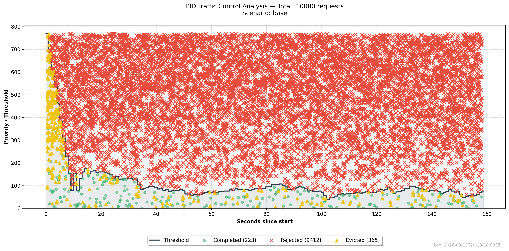

# PID Controller - Simulation Suite

This directory contains the necessary tools to stress-test the PID controller, generate synthetic traffic patterns, and run real-world server examples. It is designed to demonstrate how the controller reacts to different load levels in real-time.

## How to run

From the repository root:

```bash
make install-code
make install-simulation
make install-simulation-runner
make simulation SCENARIO=base SEED=20260913
```

You can run each step independently:

```bash
make simulation-generate SCENARIO=base SEED=20260913
make simulation-run SCENARIO=base
make simulation-report SCENARIO=base
```

## Scenarios

Scenarios use deterministic phase schedules with seeded jitter, execution latency, priority tier, and priority cohort. Reusing the same scenario and `SEED` produces the same CSV trace.

The following scenarios are available:

| Scenario            | Duration | Requests | Description                                                        |
|---------------------|----------|----------|--------------------------------------------------------------------|
| `base`              | 2 min    | 1,440    | Balanced, steady traffic with an 80 ms backend.                    |
| `aggressive_peak`   | 1.5 min  | 2,400    | Warmup, a low-importance traffic peak, and recovery.               |
| `high_latency`      | 2 min    | 960      | Steady traffic against a 300 ms backend.                           |
| `high_volume`       | 2 min    | 4,200    | Sustained high arrival rate with mostly low-importance traffic.    |
| `priority_spike`    | 2 min    | 2,400    | Balanced traffic interrupted by a high-importance phase.           |
| `stress`            | 6 min    | 9,360    | Overload, backend degradation, and recovery.                       |
| `low_latency`       | 2 min    | 1,800    | Steady traffic against a 30 ms backend.                            |
| `adaptive_soak_10m` | 10 min   | 12,180   | Exercises capacity discovery, shedding, degradation, and recovery. |
| `aggressive_peak_10m` | 10 min  | 29,040   | Two-minute 200 req/s peak after warmup; forces admission shedding. |

Generated CSV files contain absolute arrival times in milliseconds and the complete priority value used by the core: `requestId`, `scenario`, `seed`, `phase`, `arrivalTimeMs`, `executionTimeMs`, `priorityTier`, and `priorityValue`.

### Representative cases

- `aggressive_peak_10m`: verifies that low-priority traffic is rejected or evicted under a sharp peak, while more important work continues to be admitted.
- `adaptive_soak_10m`: shows the auto-tuner discovering capacity, reacting to degradation, and recovering over several statistics buckets.
- `high_latency`: isolates the controller response to a consistently slow backend without a high arrival rate.

Use the soak scenario to observe several complete statistics buckets and auto-tuner decisions:

```bash
make simulation SCENARIO=adaptive_soak_10m SEED=20260913
```

Use the aggressive scenario to make admission rejection and queue eviction visible in the traffic panel:

```bash
make simulation SCENARIO=aggressive_peak_10m SEED=20260913
```

## Report

Each simulation produces a report that shades scenario phases and plots admission outcomes, concurrency, latency signals, throughput, and adaptive queue timeout. The committed image is the latest `aggressive_peak_10m` execution; run any scenario to replace it locally:



The report title includes dispatch-lag P95 and maximum values. Treat a run as a valid timing experiment only when P95 is at most 50 ms and maximum lag is at most 500 ms; the runner emits `SCENARIO_DISPATCH_LAG` when either budget is exceeded.

> [!WARNING]  
> To output logs it is necessary to set logger level at least `debug` which is done automatically when run for tests but not for adapters since you define your own configuration.

## Servers

Practical examples using frameworks (**Express** and **NestJS** ) and its PID adapters. These servers allow you to test the PID controller implementation in a real HTTP environment calling it directly.

Both server implements PID middleware and error handler. Their route and logic are the same, both accept priority in `x-priority` header and also another header to simulate latency: `execution-time`.

The `x-priority` header represents a priority tier from `0` to `5`, where `0` is the most important traffic and `5` is the least important. The adapters convert this tier into the core `Priority` class before calling the controller.

You can test any of them calling via HTTP:

```bash
curl -H "x-priority: 4" -H "execution-time: 2000" http://localhost:3000/test
```

This `curl` will send a priority `4` and the server will be 2 seconds processing the request.

The standalone runner waits for all accepted controller promises before calling `shutdown()`, so background intervals and signal handlers are cleaned up after each simulation run.
